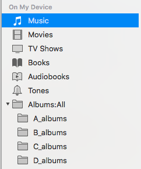

# CreateNestedFolders.scpt

A simple script for creating a root folder and subfolders inside iphone/ipad/ipod music app.
This script creates a root folder named 'Albums:All' and 26 sub folders named 'A_albums' through 'Z_album' .
It will skip creation of folder if it alreasy exists in the device. You can modify the script to meet your folder name requirement.

How to use this script :

Execute following command on Mac terminal (shell)

$ osascript CreateNestedFolders.scpt 
- ITunes window will be activated now 
- Choose the Library / Device
- On completion a dialog box shows 'Completed !'
- Any error will be shown on terminal

[[images/iTunes_folder_tree.png]]
[[../images/iTunes_folder_tree.png]]
